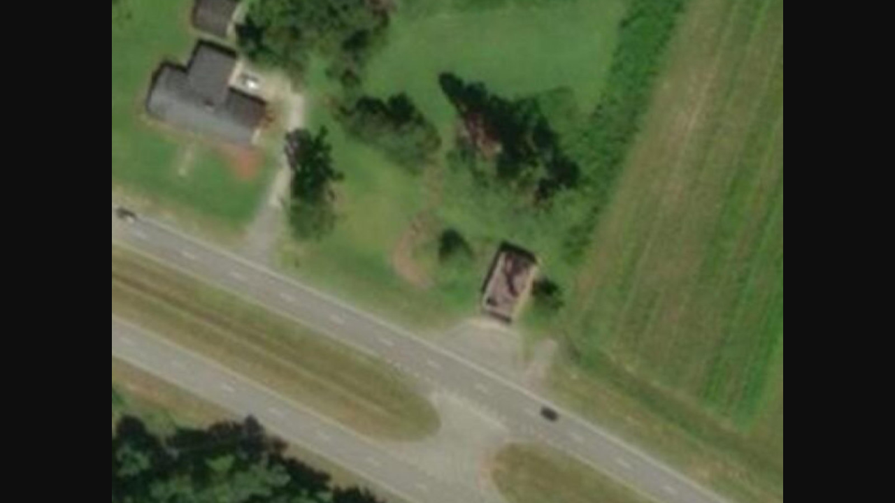
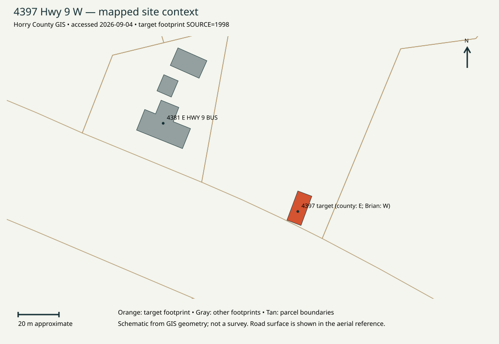

## Research result
**Building identified; dossier ready for modeling-readiness review.** Project address: **4397 Hwy 9 W, Loris area, Horry County, South Carolina**. Brian explicitly confirmed both the address wording and the researched location on September 4, 2026. The physical building is centered approximately at **34.007932, -78.764340**. The county address point uses **4397 HWY 9 E**, Loris, at 34.007917, -78.764349, PIN **21600000006**. Preserve both labels and use coordinates for reliable lookup. [County address data](https://www.horrycounty.org/parcelapp/rest/services/HorryCountyGISApp/MapServer/22/query?where=StreetNum%3D4397&outFields=ADDRESS,CITY,PIN&outSR=4326&f=pjson)
This is the small, one-story brick roadside storefront shown in the original references. It is probably the unnamed circa-1940 store recorded as Horry survey site 2082 / 201-2082. No historic trading name was established. Research supports an initial architectural discussion; exact rear openings, roof construction, dimensions and interior remain unresolved.
**Access date for all research:** 2026-09-04. This is research documentation, not a site inspection. No V1 geometry was used as ground truth.
<mention-page url="https://app.notion.com/p/3d1488886d5780e292f4e569963f0155"/> · <mention-page url="https://app.notion.com/p/3d1488886d5781c1a83dd491fb4834e8">M1 — Identify the building and assemble the research dossier</mention-page>
## Identification and corroboration
1. The local ground photographs match the three original Drive screenshots: red brick false front, two large display windows, recessed paired glazed doors, three canopy supports, stepped side walls and rearward chimney.
2. G02 retains the Google label 4381 Hwy 9 W; G05–G07 retain 4201 Hwy 9 E. These shifting panorama labels are clues, not the storefront’s established address.
3. County GIS places 4397 HWY 9 E within the narrow rectangle east/southeast of the neighboring 4381 E HWY 9 BUS residence. The county footprint and fresh aerial image match the original overhead arrangement, roadside apron and surrounding trees.
4. The 2009 state survey places commercial site 2082 one lot east of 4381 Hwy 9, near Sweet Home, and gives an approximate 1940 construction date. SCDOT’s 2012 country-store inventory lists Horry site 201-2082 as a store dated 1940. This is strong corroboration of the likely historical use, although no individual survey card/photo was retrieved to close the historic-ID match.
5. Brian confirmed the location and the project address 4397 Hwy 9 W after the independent GIS match was found.
**Rejected address shortcut:** 4381 belongs to the neighboring residence in county address/footprint data. Its residential room counts, floor area and construction date must not be applied to the storefront. No competing physical building remains after the image/GIS match and Brian’s confirmation; the east/west address wording remains a documented provider discrepancy.
[S01 address records](https://www.horrycounty.org/parcelapp/rest/services/HorryCountyGISApp/MapServer/22/query?where=StreetNum%3D4397&outFields=ADDRESS,CITY,PIN&outSR=4326&f=pjson) · [S02 footprint](https://www.horrycounty.org/parcelapp/rest/services/HorryCountyGISApp/MapServer/27/query?where=OBJECTID%3D100281&outFields=*&outSR=4326&f=pjson) · [S05 historic survey](https://nationalregister.sc.gov/SurveyReports/HC26001.pdf) · [S06 store inventory](https://www.scdot.org/content/dam/scdot-legacy/business/pdf/envtoolshed/culturalresources/Rural_Commerce_Context_SC_Country_Stores_1850-1950_2012_GuidResr.pdf)
## Source inventory and provenance
<table header-row="true">
<tr>
<td>Group</td>
<td>Inventory and source</td>
<td>Classification / use</td>
</tr>
<tr>
<td>Original references O01–O03</td>
<td>Three PNG screenshots in [Ref Original](https://drive.google.com/drive/folders/17v1bNI3uYC3J6u2FyjlTow3zwXJbbc_q), filenames dated 2025-12-31. All three visually inspected.</td>
<td>Real Google Street View photographic screenshots, not independent photographers or separate historical evidence. UI cropped; filename is screenshot date, not camera acquisition date.</td>
</tr>
<tr>
<td>Local Google images G01–G09</td>
<td>Nine images in V1 inputs/reference/google_maps_images; copied unchanged into V2 research/references/google_maps_images.</td>
<td>Eight ground views/crops plus one overhead. Four explicitly show Nov 2025 acquisition; others undated.</td>
</tr>
<tr>
<td>Local exterior_generated</td>
<td>Nine images: Front Facing View, Back View, Birdseye View, Cross Section, Left Side Facing View, Right Side Facing View, Top Left Roof Angle View, Corner View and Corner View 2.</td>
<td>Generated concepts by folder provenance. Excluded from geometry and historical proof, especially unseen rear/interior.</td>
</tr>
<tr>
<td>Local interior_generated</td>
<td>One unnamed.jpg.</td>
<td>Generated interior concept by folder provenance; no real interior evidence.</td>
</tr>
<tr>
<td>Local Doors and Windows</td>
<td>Nine files, including alternate PNG/WebP door references, back door, alcove and front-window references.</td>
<td>Generic detail/product or unknown-origin references; not evidence of this building. Back-door image inspected as isolated product/design image. Front Facing Window Reference.png could not be decoded by image viewer; origin remains unverified.</td>
</tr>
<tr>
<td>First Attempt Drive root</td>
<td>3 Gemini_Generated_Image PNGs; 3 progress screenshots; structure.yaml; house.blend, house.blend1, house.obj, house.mtl; Raw Files and Ref Original folders.</td>
<td>Generated assets, prior specs and outputs. Three progress screenshots only inventoried; their visual contents are unverified.</td>
</tr>
<tr>
<td>Raw Files Drive</td>
<td>12 files: `PROJECT_OVERVIEW.md`, `README.md`, 6 Blender files, 2 YAML specs, house.obj and house.mtl.</td>
<td>Prior implementation history; not geometric or photographic evidence.</td>
</tr>
<tr>
<td>Local V1 outputs</td>
<td>house.blend, exports/glb/building_final.glb, work/spec, reviews/validation and viewer assets.</td>
<td>Read-only prior reconstruction. A text search found prior correction of an L-shaped footprint, but V2’s rectangular conclusion rests on photographs and GIS.</td>
</tr>
<tr>
<td>New public sources</td>
<td>County address/parcel/footprint JSON, Esri aerial and imagery metadata, state survey and SCDOT inventory.</td>
<td>Independent public-source corroboration with limitations below.</td>
</tr>
</table>
The V2 local inventory contains **28 file-level records with source paths, sizes and SHA-256 hashes** in research/source-inventory.csv. Dossier annotations below classify these groups. Google copyright marks are not acquisition dates. Drive creation/modification timestamps likewise do not establish when the original photograph was taken.
## Annotated exterior reference set
G identifiers map to exact filenames retained in the V2 reference folder; all were visually inspected.
<table header-row="true">
<tr>
<td>ID / view</td>
<td>Date evidence</td>
<td>Annotation</td>
</tr>
<tr>
<td>G01 — Front detail; Screenshot 2026-01-02 152452.png</td>
<td>Undated crop; same visible condition as Nov 2025 set</td>
<td>Two display windows, recessed paired glazed doors and angled entrance returns; three visible canopy posts. Copyright 2025 is not a capture date.</td>
</tr>
<tr>
<td>G02 — Front-left oblique; Screenshot 2026-01-02 152518.png</td>
<td>Nov 2025 shown in UI</td>
<td>Long left wall partly hidden by a broadleaf tree; low vents and rearward parapet steps. UI says 4381 Hwy 9 W: camera label, not verified building address.</td>
</tr>
<tr>
<td>G03 — Front-right distant; Screenshot 2026-01-02 152534.png</td>
<td>Undated crop</td>
<td>Roadside utility pole, guy wires and tree occlusion; compare to original Drive O03. Do not infer a clear rear wall.</td>
</tr>
<tr>
<td>G04 — Front and apron; Screenshot 2026-01-02 152551.png</td>
<td>Undated crop; matches Nov 2025 condition</td>
<td>Three posts, shallow canopy, cracked apron, window/door arrangement and tree on the left.</td>
</tr>
<tr>
<td>G05 — Front-right oblique; Screenshot 2026-01-02 152613.png</td>
<td>Nov 2025 shown in UI</td>
<td>Stepped side parapet, chimney toward rear, small front-side vent and patched masonry. UI says 4201 Hwy 9 E; preserve as an inconsistent camera label.</td>
</tr>
<tr>
<td>G06 — Right elevation; Screenshot 2026-01-02 152635.png</td>
<td>Nov 2025 shown in UI</td>
<td>Broad masonry infill outlines; chimney and parapet profile. Openings are not currently open in this image.</td>
</tr>
<tr>
<td>G07 — Right elevation, wider; Screenshot 2026-01-02 152658.png</td>
<td>Nov 2025 shown in UI</td>
<td>Confirms wall length and infill; tree blocks rear corner; foundation vents visible.</td>
</tr>
<tr>
<td>G08 — Right oblique, alternate condition; Screenshot 2026-01-02 152753.png</td>
<td>Unknown; appears earlier but unproven</td>
<td>Wall-mounted AC unit and two tall pale rear-side panels/openings differ from Nov 2025. Use only as undated historical lead; do not restore them as current facts.</td>
</tr>
<tr>
<td>G09 — Overhead; Overhead -Screenshot 2026-01-02 152851.png</td>
<td>Unknown aerial acquisition</td>
<td>Elongated rectangle, canopy/apron, trees and road labelled Hwy 9 W. No scale or compass retained; no precise dimensions from this crop.</td>
</tr>
</table>
**O01 front:** central recess and paired doors, display-window proportions, three posts and paved apron. **O02 front-left/site:** mature tree beside long wall, open land, field and roadside power lines. **O03 front-right:** utility pole/guy wires, stepped parapet and tree-obscured rear. All three show the same target; their screenshot names are dated December 31, 2025.
[Open O01](https://drive.google.com/file/d/1ET-uuS2LbxY4y6X2Y8emdFz-e2But5zu/view) · [Open O02](https://drive.google.com/file/d/15ci2WPIQv3pz39ybpx0fpPuMfntP69vV/view) · [Open O03](https://drive.google.com/file/d/16mwsMoQ_Yv01roZFA7vf5uDuet1tDwO1/view)
[O03 original photograph](https://drive.google.com/file/d/16mwsMoQ_Yv01roZFA7vf5uDuet1tDwO1/view)
O03 — original Google Street View screenshot, captured by the user on/about 2025-12-31 according to filename; photographic acquisition date not visible in retained crop. Google attribution retained. The pole and tree obscure portions of the right and rear elevations.
## Site overview and dated aerial

S04 — Esri World Imagery export at the confirmed location, accessed 2026-09-04. Point metadata reports **Vantor / Vivid, acquisition 2025-10-30**, source resolution 0.34 m and accuracy field 8.47 m. These metadata describe the source at the queried point; they are not survey accuracy for this building. [Image source](https://server.arcgisonline.com/ArcGIS/rest/services/World_Imagery/MapServer/export?bbox=-78.7653,34.0075,-78.7637,34.0085&bboxSR=4326&imageSR=3857&size=1200,900&format=jpg&f=image) · [Acquisition metadata](https://services.arcgisonline.com/arcgis/rest/services/World_Imagery/MapServer/identify?geometry=-78.76434,34.00793&geometryType=esriGeometryPoint&sr=4326&layers=all:9&mapExtent=-78.7653,34.0075,-78.7637,34.0085&imageDisplay=1200,900,96&tolerance=1&returnGeometry=false&f=json)
**Read the image north-up:** the target is the narrow rectangle near the road at center-right; the larger residence to its northwest is 4381. The near highway carriageway and front apron lie south/southwest of the building. A divided roadway/median lies farther south; open cultivated land lies to the east, and trees/vegetation frame the rear and sides.
County GIS links the target address to PIN 21600000006 / TMS 0610002060, a much larger parcel than the immediate storefront clearing. Treat the mown clearing as visible scene context, not a surveyed legal lot. Stored GIS polygons also show the separate 4381 residence parcel and adjoining land. [Parcel context](https://www.horrycounty.org/parcelapp/rest/services/HorryCountyGISApp/MapServer/24/query?where=PIN%3D21600000006&outFields=PIN,TMS,Acreage,LegalDescr&outSR=4326&f=pjson)
The mapped target footprint has OBJECTID 100281 and SOURCE=1998. Its long edges are approximately 15.3 m and short edges approximately 7.35 m (about 50 × 24 ft), calculated from returned geographic vertices. **This is an old mapped envelope, not verified wall-to-wall dimensions.** Canopy inclusion and current roof-edge registration remain unresolved. Photograph comparisons must establish a plausible shell before M2 commits to scale. The source’s feature code must not be treated as proof of historic building use. [Footprint](https://www.horrycounty.org/parcelapp/rest/services/HorryCountyGISApp/MapServer/27/query?where=OBJECTID%3D100281&outFields=*&outSR=4326&f=pjson)

County GIS schematic — orange target footprint, gray neighboring footprints, tan parcel boundaries, north up. This is a relationship check, not a survey; the road surface is shown in the aerial above.
## Relevant history and evidence chronology
- **Circa 1940:** probable construction date in the state survey for the matching store site; approximate, not proven by a permit or original drawing.
- **2009 survey:** records a commercial building then vacant, near Sweet Home, site 2082. The report’s “Not Eligible” determination is historical survey context, not a statement about current protections.
- **2012 SCDOT study:** Appendix E carries Horry 201-2082 as a previously identified store, dated 1940. This likely repeats earlier survey data and is not an independent construction-date investigation.
- **Undated G08:** AC and tall pale side panels/openings appear in a different condition. Earlier date is plausible but not established.
- **2025-10-30:** date reported for the fresh Esri/Vantor aerial at this point.
- **November 2025:** newest securely dated ground evidence retained in G02/G05–G07. Right-side openings appear infilled; front glazing/canopy show deterioration.
- **2025-12-31 and 2026-01-02:** screenshot filenames in original Drive/local reference sets.
- **2026-09-04:** research access, independent GIS/aerial corroboration and Brian’s location/address confirmation.
The survey facts above were retrieved from the indexed primary PDF text. Direct S05 PDF access failed with a certificate/host error, so the table was not visually checked against a PDF page. S06 indexed Appendix E text was retrieved and its PDF endpoint responded, but no complete PDF review was performed. Historic business name, original owner, closure date and changes between dates remain unknown.
## Architectural evidence and uncertainty register
<table header-row="true">
<tr>
<td>ID / conclusion</td>
<td>Class</td>
<td>Evidence</td>
<td>Modeling consequence</td>
</tr>
<tr>
<td>E01 — Target building/location</td>
<td>Directly observed + user confirmed</td>
<td>G02/G05, O01–O03, S01/S02/S04; Brian confirmed location and 4397 Hwy 9 W on 2026-09-04.</td>
<td>Use 4397 Hwy 9 W as project label. County alternate label is 4397 HWY 9 E.</td>
</tr>
<tr>
<td>E02 — Former country store; circa 1940</td>
<td>Strongly inferred association</td>
<td>S05 survey site 2082 matches location; S06 lists Horry 201-2082 as Store, 1940.</td>
<td>Retain as probable historical identity; historical trading name and original proprietor unknown.</td>
</tr>
<tr>
<td>E03 — One-story brick exterior, simple rectangle</td>
<td>Directly observed</td>
<td>G01–G07, G09, S02/S04.</td>
<td>Build one main rectangular shell; no evidence for an L-shaped wing or a second full story.</td>
</tr>
<tr>
<td>E04 — Two display windows and recessed central entrance</td>
<td>Directly observed</td>
<td>G01/G04/G05, O01/O02.</td>
<td>Preserve paired glazed doors and angled/glazed entrance returns; avoid a flat replacement facade.</td>
</tr>
<tr>
<td>E05 — Canopy with three visible slender posts</td>
<td>Directly observed</td>
<td>G01/G04/G05, O01/O02.</td>
<td>Use shallow projecting canopy. Post material and concealed framing still need interpretation.</td>
</tr>
<tr>
<td>E06 — Stepped side parapet and chimney near rear</td>
<td>Directly observed</td>
<td>G05–G07.</td>
<td>Keep stepped silhouette and chimney; do not substitute a visible pitched residential roof.</td>
</tr>
<tr>
<td>E07 — Low-slope roof behind parapets</td>
<td>Strongly inferred</td>
<td>G09/S04 and exterior parapets.</td>
<td>Exact fall, drainage outlets, roof assembly and watertight details unverified.</td>
</tr>
<tr>
<td>E08 — About 7.35 × 15.3 m mapped footprint</td>
<td>Weakly inferred as physical dimensions</td>
<td>S02 OBJECTID 100281; SOURCE=1998; edge calculation recorded locally.</td>
<td>Use only as a starting envelope (\~24 × 50 ft); canopy inclusion, old mapping and registration error unresolved. Not a measured interior.</td>
</tr>
<tr>
<td>E09 — Front faces approximately SSW</td>
<td>Strongly inferred</td>
<td>S02 long-axis geometry and north-up S04 aerial; front identified by apron.</td>
<td>Approximate outward bearing 200 degrees; refine orientation in M2.</td>
</tr>
<tr>
<td>E10 — Patched former openings on right wall</td>
<td>Directly observed infill; strongly inferred former openings</td>
<td>G05–G08.</td>
<td>Use closed masonry for newest dated baseline; older-looking pale panels and AC are not current authoritative openings.</td>
</tr>
<tr>
<td>E11 — Rear door, windows and rear elevation</td>
<td>Weakly inferred centered door from Brian’s recollection; remaining rear details unknown</td>
<td>No unobstructed rear photograph; Brian recalls a centered door in the earlier investigation.</td>
<td>Use centered rear door as a provisional constraint (E18). Size, type and threshold remain unresolved. Do not use generated Back View as proof.</td>
</tr>
<tr>
<td>E12 — Left wall opening count</td>
<td>Weakly inferred beyond visible portions</td>
<td>G02 and tree-obscured O02.</td>
<td>Visible wall mostly solid; hidden rear section remains unresolved.</td>
</tr>
<tr>
<td>E13 — Floor elevation, wall thickness, structure</td>
<td>Unknown; future values weakly inferred</td>
<td>Low vents visible; no measured section.</td>
<td>Raised floor/crawlspace is possible, not proven. No established basement, attic access or stair requirement.</td>
</tr>
<tr>
<td>E14 — Lot, road and vegetation</td>
<td>Directly observed</td>
<td>O01/O02/S04; S03 parcel context.</td>
<td>Small apron joins near carriageway; divided highway/median, neighboring house to NW, field to E, trees behind and beside building.</td>
</tr>
<tr>
<td>E15 — Interior plan, historic fixtures and furniture</td>
<td>Invented when designed</td>
<td>No authentic interior evidence identified.</td>
<td>Choose later with Brian; respect display windows, entrance recess, chimney and shell.</td>
</tr>
<tr>
<td>E16 — Maintained final appearance</td>
<td>Invented restoration treatment, authorized project direction</td>
<td>V2 brief.</td>
<td>Preserve observed architecture while repairing surfaces; exact paint, renewed glazing and furnishings are design choices.</td>
</tr>
<tr>
<td>E17 — Current condition in September 2026</td>
<td>Unverified</td>
<td>Newest securely dated ground imagery Nov 2025; aerial metadata Oct 30, 2025.</td>
<td>Do not describe the site as inspected today or assume no change since imagery.</td>
</tr>
</table>
## Brian’s recollections and follow-up evidence — 2026-09-04
Brian recalls a door centered on the rear wall, faintly discernible through the front glazing during the earlier investigation; a flat interior ceiling; and a rear elevation lower than the front. These are user-reported recollections. The centered door and ceiling have not been independently resolved in the available images, so they are **weakly inferred working constraints**, not directly observed facts. The visible stepped parapets support a lower rearward silhouette, but ceiling level, roof slope and parapet height must remain separate architectural quantities.
Brian also reports that the building belonged to a Century Farm and served as a produce storefront. Follow-up research found:
- **S08:** Horry County’s *The Horry Planner*, Summer 2012, page 3, lists Bellamy Farms among the county’s Century Farms. [County newsletter](https://www.horrycountysc.gov/media/odekeneq/summer2012.pdf)
- **S09:** South Carolina Department of Agriculture lists Bellamy Farms as a roadside produce market at **4347 Highway 9, Loris**, matching the neighboring farm address in the stored county GIS. [SCDA market record](https://agriculture.sc.gov/roadside-market/bellamy-farms/)
- **S10:** *Grand Strand Magazine*, August 2014, reports that Wanda Bellamy began selling produce from the family’s front yard in 1982; by 2014 the market occupied a warehouse-like building. This supports the farm’s produce-sales history but does **not** establish that the small brick target was its original shop. [The Strand’s Stands](https://grandstrandmag.com/feature/the_strands_stands)
**Conclusion:** the Century Farm lead is substantially corroborated for nearby Bellamy Farms. The specific historical ownership/use link between that farm and the 4397 brick store remains **weakly inferred from Brian’s recollection and proximity**; do not rename the target “Bellamy Farms Store” as a documented historic name. The farm’s reported 1982 produce-sales start must not be confused with the target’s probable circa-1940 construction.
**E18 — centered rear door:** weakly inferred from Brian’s recollection; use as a provisional rear-door location, preserving a possible front-to-rear sightline. Door size, type, threshold and present condition remain unknown.
**E19 — flat interior ceiling:** weakly inferred from Brian’s recollection; plausible below a roof/parapet that falls toward the rear. No ceiling height established.
**E20 — farm produce storefront:** user-reported historical use; neighborhood farm identity and Century Farm status corroborated by S08/S09, exact building association unverified.
Brian confirms he has no additional real photographs or measurements beyond Google Maps. The remaining research should therefore use accessible public imagery and records without expecting further private references from him.
One wording clarification is pending: whether “pillars on top” coming down referred to the parapets stepping toward the rear or physical collapse over time. Photographs support stepped parapets; a collapse history is not established.
## Modeling-readiness review
**Assessment: sufficient for the M2 planning discussion and a provisional photographic blockout.** The location, main form, front openings, canopy, parapets and immediate setting are supported. An exact measured reconstruction is not supported.
Before blockout, record these decisions in M2:
1. Establish a provisional shell scale using the old GIS envelope and independent facade/brick/door proportion checks; keep wall dimensions and canopy depth adjustable.
2. Discuss a maintained produce-store interior with Brian, now supported as a direction by his recollection. A front sales area and rear service space are a proposal, not an approved room plan. No residential bedroom count is evidenced.
3. Use Brian’s centered rear-door recollection as the provisional location and preserve a possible sightline through the building. Further details of the unseen rear and service arrangement remain inferred/invented unless clearer imagery is found.
4. Preserve the latest dated exterior’s closed side-wall infill unless Brian explicitly chooses a historical restoration. Working-window requirements need a plausible operable glazing detail without arbitrary new side openings.
5. Repair deteriorated surfaces for the already-approved maintained visual direction while preserving observed massing, brickwork, openings and silhouette.
**M1 closeout — 2026-09-04:** Dossier and modeling-readiness findings were presented to Brian. He confirmed the building/location, supplied rear-door, ceiling and farm-use recollections, and confirmed there are no additional private references. The review is recorded and all five research deliverables are complete. The assistant assesses the evidence as sufficient for M2 planning and a provisional blockout. Exact dimensions, unseen rear/interior details, the farm-to-building historical link and the ambiguous roof/parapet wording remain documented uncertainties; they do not prevent closing this focused research ticket. This does not record approval of an interior plan or claim that Brian resolved the roof wording.
## Access limitations and precise resume point
Live Google Maps opened in limited mode; a coordinate-based Street View request returned no imagery. This does not establish that Street View is unavailable to Brian. The existing November 2025 screenshots remain the best securely dated ground evidence inspected.
Original Drive images were successfully fetched and visually inspected through the connector; direct browser access required sign-in. There is no remaining access blocker for the available original photographs.
No authentic interior image or clear rear elevation was found in this focused session. Missing dimensions and these views are recorded uncertainties, not concealed assumptions.
**Resume:** M1 is complete. Present and confirm M2 scope before creating/starting that separate architectural ticket. Carry the evidence register forward and resolve geometry choices during blockout planning; no further M1 research or user answer is required for closeout.
## Sources
- **S01** — [Horry County address query](https://www.horrycounty.org/parcelapp/rest/services/HorryCountyGISApp/MapServer/22/query?where=StreetNum%3D4397&outFields=ADDRESS,CITY,PIN&outSR=4326&f=pjson)
- **S02** — [Horry County target footprint](https://www.horrycounty.org/parcelapp/rest/services/HorryCountyGISApp/MapServer/27/query?where=OBJECTID%3D100281&outFields=*&outSR=4326&f=pjson)
- **S03** — [Horry County parcel context](https://www.horrycounty.org/parcelapp/rest/services/HorryCountyGISApp/MapServer/24/query?where=PIN%3D21600000006&outFields=PIN,TMS,Acreage,LegalDescr&outSR=4326&f=pjson)
- **S04** — [Esri World Imagery, target area](https://server.arcgisonline.com/ArcGIS/rest/services/World_Imagery/MapServer/export?bbox=-78.7653,34.0075,-78.7637,34.0085&bboxSR=4326&imageSR=3857&size=1200,900&format=jpg&f=image)
- **S04m** — [Esri imagery acquisition metadata](https://services.arcgisonline.com/arcgis/rest/services/World_Imagery/MapServer/identify?geometry=-78.76434,34.00793&geometryType=esriGeometryPoint&sr=4326&layers=all:9&mapExtent=-78.7653,34.0075,-78.7637,34.0085&imageDisplay=1200,900,96&tolerance=1&returnGeometry=false&f=json)
- **S05** — [Horry County historic survey, 2009, inventory printed page 58](https://nationalregister.sc.gov/SurveyReports/HC26001.pdf)
- **S06** — [SCDOT rural commerce context, 2012, Appendix E](https://www.scdot.org/content/dam/scdot-legacy/business/pdf/envtoolshed/culturalresources/Rural_Commerce_Context_SC_Country_Stores_1850-1950_2012_GuidResr.pdf)
- **S07** — [County land information and mapping limitations](https://www.horrycountysc.gov/land-info/)
- **O01** — [Original front view, screenshot 2025-12-31 12.15.09 PM](https://drive.google.com/file/d/1ET-uuS2LbxY4y6X2Y8emdFz-e2But5zu/view)
- **O02** — [Original front-left/site view, screenshot 2025-12-31 12.15.17 PM](https://drive.google.com/file/d/15ci2WPIQv3pz39ybpx0fpPuMfntP69vV/view)
- **O03** — [Original front-right view, screenshot 2025-12-31 12.15.33 PM](https://drive.google.com/file/d/16mwsMoQ_Yv01roZFA7vf5uDuet1tDwO1/view)
- [Original reference folder](https://drive.google.com/drive/folders/17v1bNI3uYC3J6u2FyjlTow3zwXJbbc_q)
- [V1 First Attempt inventory](https://drive.google.com/drive/folders/1GZY6xl4K7KWAe9qoD6YSfASvDx7gD9hy)
- [V1 Raw Files inventory](https://drive.google.com/drive/folders/1B5S0UocXXf-Q9K65ciefBFVxqr-U4VHh)
- V1 local inputs/reference — original paths and hashes in V2 research/source-inventory.csv.
- Brian’s messages in this session, 2026-09-04: confirmed 4397 Hwy 9 W and the researched location.
